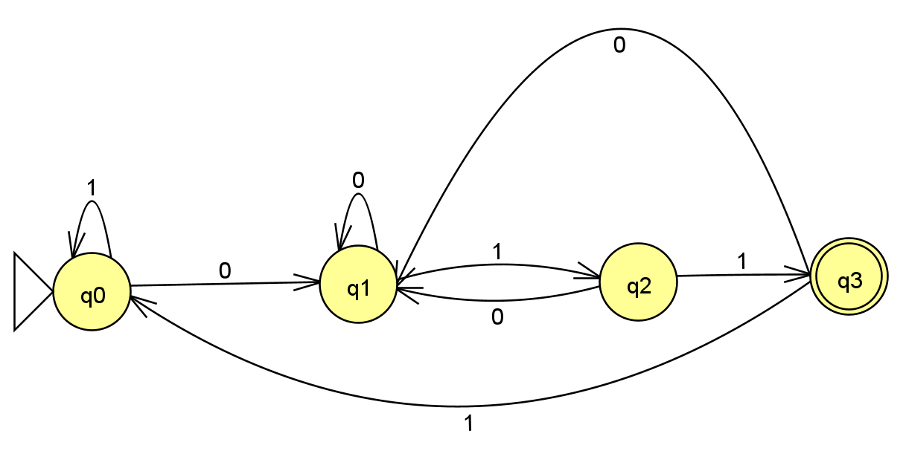

# pytomatos

Algoritimo para teste de automatos finitos deterministicos e não deterministicos utilizando python.  
Desenvolvido para a matéria de Automatos Finitos e Deterministicos, ministrada pelo professor Adolfo Guimarães na Universidade Tiradentes.

## Carregando o automato

Para carregar o automato, devemos configurar o arquivo `automato.json`, presente na raíz do projeto.

Por exemplo, para o automato abaixo, que aceita strings compostas por 0’s e 1’s que terminam com 011:



temos o seguinte `automato.json`:
```json
{
  "alphabet": ["0", "1"],
  "initial_state": "q0",
  "final_state": "q3",
  "transitions": {
    "q0": {
      "0": "q1",
      "1": "q0"
    },
    "q1": {
      "0": "q1",
      "1": "q2"
    },
    "q2": {
      "0": "q1",
      "1": "q3"
    },
    "q3": {
      "0": "q1",
      "1": "q0"
    }
  }
}
```

## Desenvolvedores

- Natália Braga da Fonseca  
- Vinícius José Santana de Mendonça
