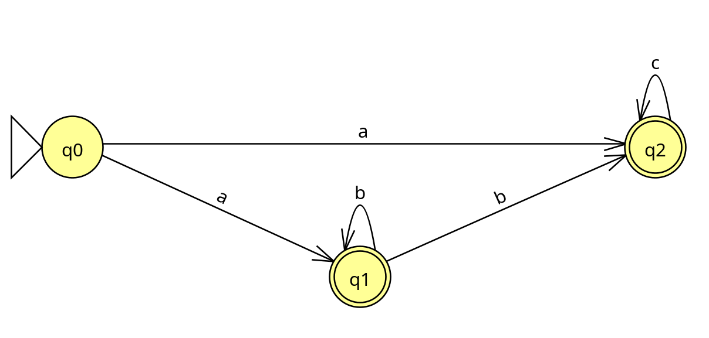

# pytomatos

Algoritimo para teste de automatos finitos deterministicos e não deterministicos utilizando python.  
Desenvolvido para a matéria de Automatos Finitos e Deterministicos, ministrada pelo professor Adolfo Guimarães na Universidade Tiradentes.

## Carregando o automato

Para carregar o automato, devemos configurar o arquivo `automato.json`, presente na raíz do projeto.
O seguinte autômato deve conter os seguintes campos:

* Type: É o tipo do autômato, sendo `afd` para Automatos Finitos Deterministicos e `afn` para Automatos Finitos Não Deterministicos;
* Alphabet: É o conjunto de simbolos reconhecidos pelo automato;
* Initial_State: É o estado inicial do automato;
* Final_States: São os estados finais do automato;
* Transitions: São as transições entre estados do automato.

### Automatos Finitos Deterministicos

Por exemplo, para o automato finito deterministico abaixo, que aceita strings compostas por 0’s e 1’s que terminam com 011:


temos o seguinte `automato.json`:

```json
{
  "type": "afd",
  "alphabet": ["0", "1"],
  "initial_state": "q0",
  "final_states": ["q3"],
  "transitions": {
    "q0": {
      "0": "q1",
      "1": "q0"
    },
    "q1": {
      "0": "q1",
      "1": "q2"
    },
    "q2": {
      "0": "q1",
      "1": "q3"
    },
    "q3": {
      "0": "q1",
      "1": "q0"
    }
  }
}
```

Note que as transições recebem apenas o proximo estado, em formato de string!  
É importante ressaltar ainda que "type" deve receber sempre `afd` para Automatos Finitos Deterministicos.

### Automatos Finitos Não Deterministicos

No caso dos automatos finitos não deterministicos, configuramos o arquivo `automato.json` de forma que cada transição recebe uma lista de estados, em vez de um único estado (mesmo que haja apenas um, deve ser passado dentro de uma lista!!).

Por exemplo, para o automato abaixo, que reconhece a linguagem `ab*c*`:



temos o seguinte `automato.json`:

```json
{
  "type": "afn",
  "alphabet": ["a", "b", "c"],
  "initial_state": "q0",
  "final_states": ["q1", "q2"],
  "transitions": {
    "q0": {
      "a": ["q1", "q2"]
    },
    "q1": {
      "b": ["q1", "q2"]
    },
    "q2": {
      "c": ["q2"]
    }
  }
}
```

Ressaltando que "type" deve receber sempre `afn` no caso Automatos Finitos Não Deterministicos.

## Executando o Programa

Para iniciar a o programa, basta executar o arquivo `main.py` e seguir as instruções do Menu!

## Desenvolvedores

- Natália Braga da Fonseca
- Vinícius José Santana de Mendonça
